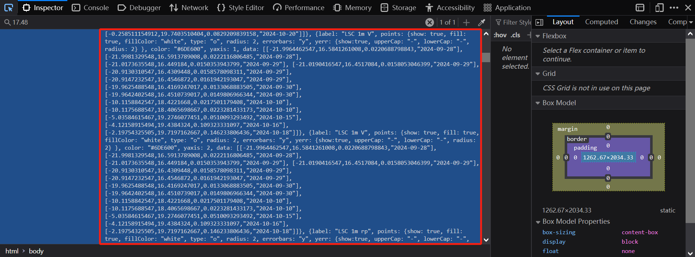
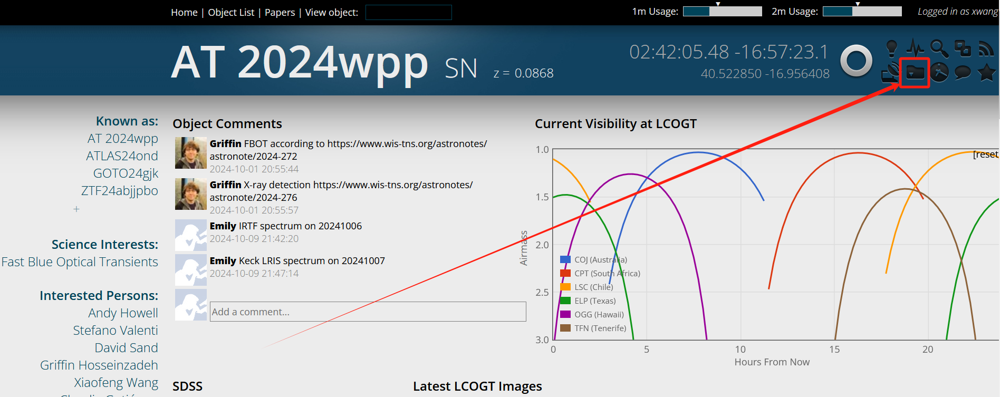
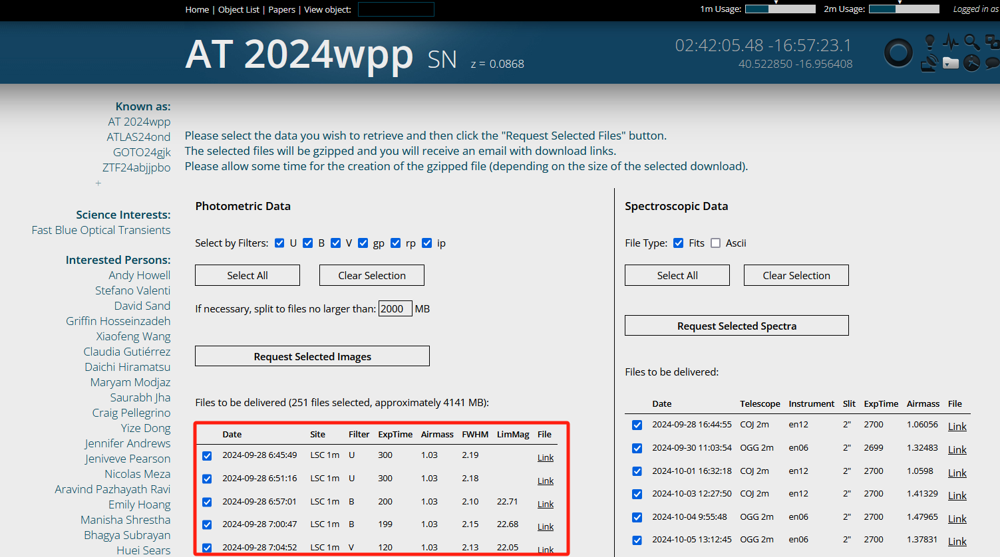
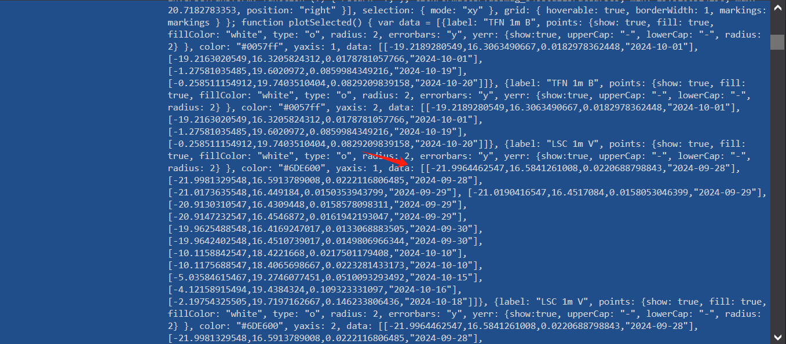
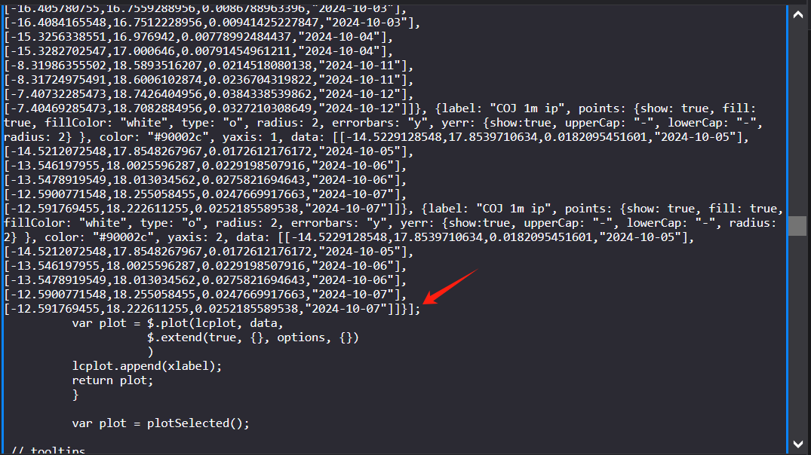

# 非常规手段(获得数据仅用作亮度参考，千万注意数据版权问题)
By 闫圣钰 & 刘嘉联   
LCOGT是全球布局的，自动化程度非常高的巡天项目。里面会有大量有趣的暂现源的多波段测光数据。我们在指定我们的观测计划的时候，如果我们的测光数据缺失，可能会需要用到参考数据。并且为了验证我们的测光结果是否正确，LCOGT的测光结果也会是一个很好的参考。**但是注意千万不要外传数据**，如果没有得到许可，千万不要用这些数据写在自己的文章中发表。
接下来我介绍一下快速获取其测光结果的方法：   
我们的主要方法是，在LCOGT半公开数据的展示网址[SNeExchange](https://supernova.exchange/public/)上。对网页源代码数据进行手动爬取。
- `选定搜索关键字` 打开任意一个目标源的主网页（最开始展示综合数据页面），会发现有展示全部Photometry数据的框。鼠标放在任意一测光点上（如下图绿框），即可的到如下图的橘红色背景panel（记p1）：
  
p1记录了此测光点的视星等，绝对星等，观测日期等。我们需要记录下视星等的数字，即`17.48`。
- `检索源代码` 在目前的网页下，按Shift+Ctrl+C(火狐、Chrome浏览器默认按键)，打开浏览器监视器。
    - Chrome用Ctrl+F打开搜索栏，火狐会直接有`Search HTML`搜索栏。搜索栏搜索`17.48`，可得包含有测光数据的网页源代码位置（下图红框）：
    
- `获得参考相位时间`。见上图，任取一个测光数据：   
```javescript
[-12.5900771548,18.255058455,0.0247669917663,"2024-10-07"]
```
以上四个数值分别是，`于多少天前拍摄测光点（拍摄时间）`、`测光视星等`、`视星等误差`、`观测日期（精确到天）`。由于网页源代码的数据中，并不会给我们精确的测光拍摄时间。所以我们需要计算`于多少天前拍摄测光点（拍摄时间）`参考时间。   
在源代码中，相同望远镜，相同的波段，会被打包在一个列表中记录，如下：
```javescript
{label: "COJ 1m ip", 
points: {show: true, fill: true, fillColor: "white", type: "o", radius: 2, errorbars: "y", yerr: {show:true, upperCap: "-", lowerCap: "-", radius: 2} }, color: "#90002c", yaxis: 1, 
data: [
    [-14.5229128548,17.8539710634,0.0182095451601,"2024-10-05"], 
    [-14.5212072548,17.8548267967,0.0172612176172,"2024-10-05"], 
    [-13.546197955,18.0025596287,0.0229198507916,"2024-10-06"], 
    [-13.5478919549,18.013034562,0.0275821694643,"2024-10-06"], 
    [-12.5900771548,18.255058455,0.0247669917663,"2024-10-07"], 
    [-12.591769455,18.222611255,0.0252185589538,"2024-10-07"]]}
```
`label`中就是**COJ 1m**是望远镜名字，**ip**是滤光片名字。点击在网页右上角`Batch Download Data`，见下图。

出现以下界面：

红框中就是fits数据中的一些信息。这时候，任意选以上`COJ 1m ip`中一个测光点，发挥你的聪明智慧，找到对应的数据。

"2024-10-05 18:29:12"即为第一个`COJ 1m ip`观测数据的观测时间,对应的是-14.5229128548天之前拍摄的。我们用python
```python
astropy.time.Time("2024-10-05 18:29:12",format="iso").mjd-(-14.5229128548)
```
即为参考相位时间的MJD。其他所有的日期都用这个参考时间。
- `整理数据` 在原网页中，适当选取内容，如下图
`data:`之后：

分号之前：

整理成一个js的文件。
然后用刘嘉联写的小程序[./read_LCO.py](./read_LCO.py)。修改文件名和参考时间。
```python
input_file = 'LCO.js'
MJD0 = 60584.07425925927 + 19.1230947217
```
和输出文件名称，
```python 
data.to_csv('LCO.dat',index=False)
```
即可转化为可读性较强的数据文件。
