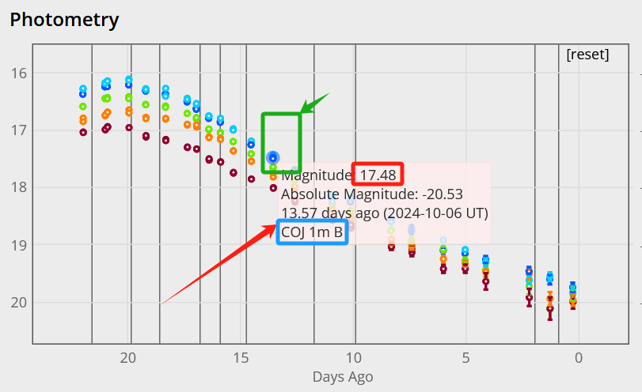

# 非常规手段(获得数据仅用作亮度参考，千万注意数据版权问题)
By 闫圣钰 & 刘嘉联
LCOGT是全球布局的，自动化程度非常高的巡天项目。里面会有大量有趣的暂现源的多波段测光数据。我们在指定我们的观测计划的时候，如果我们的测光数据缺失，可能会需要用到参考数据。并且为了验证我们的测光结果是否正确，LCOGT的测光结果也会是一个很好的参考。**但是注意千万不要外传数据**，如果没有得到许可，千万不要用这些数据写在自己的文章中发表。
接下来我介绍一下快速获取其测光结果的方法：   
我们的主要方法是，在LCOGT半公开数据的展示网址[SNeExchange](https://supernova.exchange/public/)上。对网页源代码数据进行手动爬取。
    - `选定搜索关键字` 打开任意一个目标源的主网页（最开始展示综合数据页面），会发现有展示全部Photometry数据的框。鼠标放在任意一测光点上（如下图绿框），即可的到如下图的橘红色背景panel（记p1）：
      
    p1记录了此测光点的视星等，绝对星等，观测日期等。我们需要记录下视星等的数字，即`17.48`。
    - `检索源代码` 在目前的网页下，按Shift+Ctrl+C(火狐、Chrome浏览器默认按键)，打开浏览器监视器。
        - Chrome用Ctrl+F打开搜索栏，火狐会直接有`Search HTML`搜索栏。搜索栏搜索`17.48`